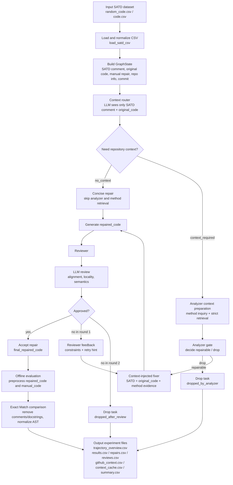

# SATD System Flow

## Reporting Notes

- The system no longer hardcodes special SATD classes.
- The LLM context router is the first decision point.
- `no_context` tasks skip analyzer and go directly to concise repair.
- `context_required` tasks enter analyzer context retrieval and filtering before fixer/reviewer.
- Ground truth `manual_code` is used only for offline Exact Match evaluation after the workflow finishes.
