# SATD 系统流程图

```mermaid
flowchart TD
    A["输入 SATD 数据集<br/>random_code.csv / code.csv"] --> B["CSV 读取与字段标准化<br/>load_satd_csv"]
    B --> C["构造 GraphState<br/>SATD 注释、原代码、人工修复、仓库信息、commit"]
    C --> D["LangGraph 工作流启动<br/>analyze -> repair -> select -> review"]

    D --> E{"Analyzer 阶段"}
    E -->|默认关闭| E1["启发式直通<br/>标记为 repairable"]
    E -->|--enable-analyzer| E2["LLM 分析可修复性<br/>风险、范围、上下文缺口"]
    E2 --> E3{"是否可修复?"}
    E3 -->|否| X["丢弃任务<br/>dropped_by_analyzer"]
    E3 -->|是| F
    E1 --> F["基础上下文构建/复用<br/>context_cache/task_id.json"]

    F --> G["GitHub / 本地仓库缓存取证<br/>目标文件、commit 快照、符号信息"]
    G --> H["SATD 路由识别<br/>generic / type_annotation / replace_symbol / document / remove_temporary"]

    H --> I["Fixer 修复阶段<br/>默认 baseline_context 单候选"]
    I --> J{"是否需要方法上下文?"}
    J -->|规则跳过<br/>文档、类型标注、替换符号等| K["直接构造修复提示词"]
    J -->|generic 且存在候选方法| L["方法询问<br/>LLM 从候选调用中选择必须理解的方法"]
    L --> M["严格方法检索<br/>当前文件优先 + 仓库符号索引 + Tree-sitter/正则解析"]
    M --> N["记录检索结果<br/>retrieved_methods / missing_method_names"]
    N --> O["合成编辑约束<br/>保留签名、避免无证据 helper、限制控制流扩张"]
    O --> K

    K --> P["上下文注入修复<br/>SATD 注释 + original_code + 方法实现 + 缺失方法列表"]
    P --> Q["LLM 生成 repaired_code<br/>同时记录 repair_debug 检查点"]

    Q --> R{"Selector 阶段"}
    R -->|默认关闭| R1["按默认候选顺序选择<br/>单修复路径"]
    R -->|use_selector / 双候选| R2["选择最可能匹配人工最小修复的候选"]
    R1 --> S
    R2 --> S["Reviewer 阶段"]

    S --> T{"Reviewer 是否开启?"}
    T -->|默认关闭| T1["直接接受 Fixer 输出"]
    T -->|--enable-review| T2["LLM 严格审查<br/>一致性、最小性、语义保持"]
    T2 --> T3{"审查通过?"}
    T3 -->|通过| U["接受修复<br/>final_repaired_code"]
    T3 -->|不通过且轮数未满| I
    T3 -->|不通过且轮数已满| Y["丢弃任务<br/>dropped_after_review"]
    T1 --> U

    U --> V["离线评估<br/>预处理 repaired_code 与 manual_code"]
    V --> W["Exact Match 对比<br/>去注释、去 docstring、AST 规范化"]
    W --> Z["输出实验结果<br/>trajectory_overview.csv<br/>results.csv / repairs.csv / reviews.csv<br/>github_context.csv / context_cache.csv / summary.csv"]

    X --> Z
    Y --> Z
```

## 汇报时可以强调的主线

- 当前系统是基于 LangGraph 的 SATD 自动修复流程，默认采用修复优先的单候选路径。
- 关键改进点在 Fixer：先判断哪些方法必须理解，再用仓库 commit 快照和 Tree-sitter 做严格方法级检索，最后把检索到的方法实现注入修复提示。
- Analyzer、Reviewer、Selector 仍保留为可选模块，但默认实验中关闭，用于减少额外决策噪声。
- Ground truth `manual_code` 只在流程结束后用于离线 Exact Match 评估，不参与修复决策。
